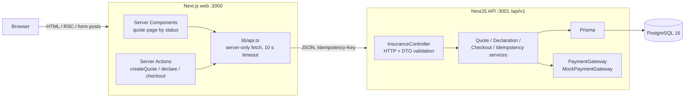
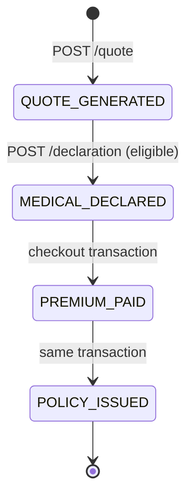

# CareShield Max: D2C health insurance buy journey

A consumer buys the **CareShield Max** health plan online in three steps: get a deterministic
**quote** that is price-locked for 15 minutes, submit a **medical declaration** that is checked for
eligibility, then **check out** with a mock payment that is charged exactly once and atomically
issues a policy. The stack is a Next.js 15 frontend (React Server Components + Server Actions), a
NestJS 11 API, Prisma 6 and PostgreSQL 16.

> _Screenshot placeholder: quote → declaration → payment → policy confirmation._

---

## Quick start

**Prerequisites:** Node.js 20+ and Docker (with Compose).

```bash
npm install                          # installs both workspaces, generates the Prisma client
cp apps/api/.env.example apps/api/.env
cp apps/web/.env.example apps/web/.env.local
npm run db:setup                     # starts Postgres 16 and applies migrations
npm run dev                          # API on http://localhost:3001, web on http://localhost:3000
```

Open <http://localhost:3000>.

```bash
npm test         # API unit + e2e tests (real Postgres, `test` schema) and the web test
npm run lint
npm run build
```

The database is **ephemeral** (`tmpfs`): after `docker compose down`, run `npm run db:setup` again.
The e2e tests need the database running; they apply migrations to a separate `test` schema and
truncate tables between tests.

### Demo expiry quickly

Set `QUOTE_TTL_SECONDS=30` in `apps/api/.env` and restart `npm run dev`. Quotes then expire after
30 seconds: the timer turns amber and red, the forms disable, and the API returns `410` even if
you bypass the UI.

---

## Architecture



- There is no authentication yet, so a quote id is effectively a bearer token for that quote.
  The web app sends `Referrer-Policy: no-referrer` so quote URLs don't leak to other sites; real
  per-customer auth is the first item under "What I'd do next".
- The browser never calls the API directly. Server Components and Server Actions call it
  server-side using `API_BASE_URL`, which is never exposed to the client.
- Controllers only handle HTTP and DTOs. Business rules live in services. The premium calculator
  and state machine are pure modules with unit tests.
- One global exception filter maps every error to a single envelope and never leaks stack traces
  or Prisma internals:
  `{ "statusCode": 410, "code": "QUOTE_EXPIRED", "message": "…", "details": null }`.

## State machine



- The allowed transitions are a single map (`quote-state-machine.ts`). Anything else is rejected
  with `409 INVALID_STATE`.
- Every transition is a **compare-and-set** update:
  `UPDATE … WHERE id = $1 AND status = $from AND expires_at > $now`. If no row changes, the quote
  is re-read to return a precise `404`, `409` or `410`. Two concurrent requests can never both move
  the same quote.
- **Expiry is derived** (`expires_at <= now`), not stored as a status. Every state-changing
  endpoint enforces it on the server. `now` is the API server's clock, which also stamps
  `created_at`/`expires_at`, so a single instance is self-consistent; with several instances,
  keep their clocks NTP-synced.
- `PREMIUM_PAID` is set and left inside the checkout transaction, so it is never visible outside
  it. It still exists and is traversed, so the state machine matches the business process.
- An ineligible declaration returns `422` and does **not** change state.

## Premium rules

`total = 10,000 + (age > 45 ? 5,000 : 0) + (hasPreExistingConditions ? 5,000 : 0)` in INR.

| Age | Pre-existing conditions | Base   | Age loading (50% of base) | Condition loading | Total      |
| --- | ----------------------- | ------ | ------------------------- | ----------------- | ---------- |
| 30  | No                      | 10,000 | 0                         | 0                 | **10,000** |
| 45  | No                      | 10,000 | 0 (strictly over 45 only) | 0                 | **10,000** |
| 46  | No                      | 10,000 | 5,000                     | 0                 | **15,000** |
| 30  | Yes                     | 10,000 | 0                         | 5,000             | **15,000** |
| 52  | Yes                     | 10,000 | 5,000                     | 5,000             | **20,000** |

- Ages 18 to 99 inclusive (integers only).
- Money is `NUMERIC(10,2)` in Postgres and `Decimal` in code, and the API sends it as strings
  (`"15000.00"`). No floating point is used for money anywhere.
- The calculator is a pure function: same input, same output, with no clock, randomness or I/O.
- Database `CHECK` constraints back the invariants: age range,
  `total = base + age_loading + condition_loading`, `expires_at > created_at` and `premium_paid > 0`.

## Medical declaration rules

Evaluated in order:

1. The quote must be `QUOTE_GENERATED` (else `409 INVALID_STATE`) and unexpired (else `410`).
2. **Consistency:** if the quote was priced _without_ pre-existing conditions but the declaration
   lists any, the response is `422 DECLARATION_INCONSISTENT` and the user is asked to recalculate.
3. **Eligibility:** a critical illness diagnosis, cancer or heart disease gives `422 NOT_ELIGIBLE`
   with a reason. State is unchanged.
4. **Repricing:** if the quote was priced _with_ pre-existing conditions but the declaration says
   `NONE`, the condition loading is removed so the customer never pays for conditions they don't
   have. The response has `"repriced": true`, the original total is kept in the stored declaration
   (`repricedFromTotal`) for audit, and the 15-minute price lock is not extended.
5. Otherwise the declaration is stored and the quote moves to `MEDICAL_DECLARED`. The status change
   and any repricing are one compare-and-set update.

`conditions` must be non-empty and unique, and `NONE` cannot be combined with other conditions.

---

## API reference

Base URL `http://localhost:3001/api/v1`. All bodies are JSON with camelCase fields. Validation is
strict: unknown fields are rejected and types are not coerced (for example `"age": "52"` is a
`400`).

### Create a quote: `POST /insurance/quote` → `201`

```bash
curl -s -X POST http://localhost:3001/api/v1/insurance/quote \
  -H 'Content-Type: application/json' \
  -d '{"age": 52, "hasPreExistingConditions": true}'
```

```json
{
  "quoteId": "0b6f…",
  "status": "QUOTE_GENERATED",
  "currency": "INR",
  "premium": {
    "base": "10000.00",
    "ageLoading": "5000.00",
    "conditionLoading": "5000.00",
    "total": "20000.00"
  },
  "createdAt": "2026-09-26T12:00:00.000Z",
  "expiresAt": "2026-09-26T12:15:00.000Z",
  "serverTime": "2026-09-26T12:00:00.012Z"
}
```

### Read a quote: `GET /insurance/quote/:quoteId` → `200`

Returns the same shape plus `age`, `hasPreExistingConditions`, `policy` (or `null`) and a fresh
`serverTime`. The frontend uses it to render the right step on refresh and to correct for client
clock skew. Expired quotes still return `200`.

### Medical declaration: `POST /insurance/declaration` → `200`

```bash
curl -s -X POST http://localhost:3001/api/v1/insurance/declaration \
  -H 'Content-Type: application/json' \
  -d '{"quoteId": "<quoteId>", "isSmoker": false, "hospitalizedLast24Months": false,
       "hasCriticalIllnessDiagnosis": false, "conditions": ["DIABETES"], "additionalDetails": ""}'
```

```json
{
  "quoteId": "…",
  "eligible": true,
  "status": "MEDICAL_DECLARED",
  "repriced": false,
  "premium": {
    "base": "10000.00",
    "ageLoading": "5000.00",
    "conditionLoading": "5000.00",
    "total": "20000.00"
  },
  "expiresAt": "…",
  "serverTime": "…"
}
```

Errors: `400`, `404`, `409 INVALID_STATE`, `410 QUOTE_EXPIRED`, `422 DECLARATION_INCONSISTENT`,
`422 NOT_ELIGIBLE`.

### Checkout: `POST /insurance/checkout` → `200`

`Idempotency-Key` is required (8–128 characters from `[A-Za-z0-9_-]`). The header
`idempotency_key` is accepted as an alias, and the canonical header wins if both are sent. Note
that some proxies (e.g. nginx with its default `underscores_in_headers off`) drop headers with
underscores, so clients behind one must use `Idempotency-Key`. Mock payment tokens: `tok_success`,
`tok_declined`, `tok_error`.

```bash
KEY=checkout-$(date +%s)
curl -si -X POST http://localhost:3001/api/v1/insurance/checkout \
  -H 'Content-Type: application/json' \
  -H "Idempotency-Key: $KEY" \
  -d '{"quoteId": "<quoteId>", "paymentToken": "tok_success"}'
```

```json
{
  "quoteId": "…",
  "status": "POLICY_ISSUED",
  "policy": {
    "id": "…",
    "policyNumber": "CSM-2026-7F3K9Q2M",
    "premiumPaid": "20000.00",
    "currency": "INR",
    "issuedAt": "…"
  },
  "paymentReference": "pay_…"
}
```

**Replay:** run the same command again with the same `$KEY`. You get the identical body with the
header `Idempotent-Replayed: true`, and no second charge or policy.

Errors: `400 IDEMPOTENCY_KEY_REQUIRED`, `404`, `409 INVALID_STATE`, `409 REQUEST_IN_PROGRESS`
(with `Retry-After: 1`), `410 QUOTE_EXPIRED`, `402 PAYMENT_FAILED`, `422 IDEMPOTENCY_KEY_REUSED`,
`502 PAYMENT_GATEWAY_ERROR`.

### Health: `GET /health` → `{ "status": "ok" }` (runs `SELECT 1` against the database)

---

## Idempotency and atomicity design

Checkout must never charge twice or issue two policies, whatever the client does (double clicks,
retries, parallel tabs), and a failure must never leave a paid quote without a policy.

**1. Acquire the key.** The service inserts `idempotency_keys(key, request_hash, IN_PROGRESS)`. The
primary key makes this an atomic lock. If the key already exists:

| Existing row                           | Response                                                        |
| -------------------------------------- | --------------------------------------------------------------- |
| different `request_hash`               | `422 IDEMPOTENCY_KEY_REUSED`                                    |
| `COMPLETED`                            | stored status and body, with `Idempotent-Replayed: true`        |
| `IN_PROGRESS`, fresh                   | `409 REQUEST_IN_PROGRESS` with `Retry-After: 1`                 |
| `IN_PROGRESS`, older than the lock TTL | taken over with compare-and-set on `locked_at` (crashed holder) |

The request hash is a SHA-256 of the canonical `{ quoteId, paymentToken }`.

**2. Pre-check the quote.** The quote must exist, be `MEDICAL_DECLARED` and be unexpired. This is a
fast fail before charging, not the authoritative check.

**3. Charge outside any DB transaction.** A network call must never hold a database connection or
row locks. The gateway gets the stored `total_premium` as a string, never a recomputed number.

**4. Commit in one transaction:**

- compare-and-set `MEDICAL_DECLARED → PREMIUM_PAID` (still unexpired);
- insert the policy (`policies.quote_id` is `UNIQUE`);
- compare-and-set `PREMIUM_PAID → POLICY_ISSUED`;
- mark the idempotency key `COMPLETED` **with the response body**.

Because the stored response is written in the same transaction as the policy, "policy exists" and
"key completed" can never disagree: a retry either replays the exact response or finds no policy.

**5. Compensate.** If the transaction fails after a successful charge, the service first
re-confirms (compare-and-set on `locked_at`, which also restarts the lock TTL) that it still owns
the key, and only then refunds. A failed refund is logged at `ERROR` with the quote id and payment
reference for reconciliation. If the key is no longer ours, nothing is refunded:

- it was **taken over** by a retry, which reuses this same charge (same gateway key) and would
  otherwise issue a policy against a refunded payment;
- it is **completed**, meaning the commit actually succeeded (e.g. the connection dropped after
  `COMMIT`) and the charge backs a real policy;
- the database is **unreachable**, so the outcome is unknown. The key then stays `IN_PROGRESS`,
  and a retry after the lock TTL takes it over and commits against the same charge.

The remaining assumption is that a refund call completes well within the lock TTL.

**Stored versus released.** Deterministic business outcomes are stored against the key and
replayed: declined card (`402`), unknown quote (`404`), expired quote (`410`) and invalid state
(`409`). Transient
failures **release** the key (the row is deleted) so the client may retry with the same key:
gateway unavailable (`502`) and unexpected errors (`500`).

**Defence in depth.** Two _different_ keys racing on the same quote still cannot both issue a
policy. The compare-and-set on status admits only one, and the `UNIQUE(quote_id)` constraint
backs it up. The loser gets `409 INVALID_STATE`, and if it had already been charged it is refunded.

**Gateway idempotency.** The mock gateway is itself idempotent per key, like real gateways. The
key sent to it is the client key plus the lock's creation time. A stale-lock takeover reuses the
original charge instead of charging again, while a retry after a released key (which was refunded)
makes a fresh charge rather than replaying the refunded one.

### Frontend protections (they reduce duplicates; the backend is the safeguard)

- `useActionState` drives the pay button: it is disabled with a spinner, "Processing payment…" and
  `aria-busy` while the action is pending.
- A `useRef` lock is checked **synchronously** in `onSubmit`, because `disabled` only applies after
  a re-render and a fast double click can land before that.
- One idempotency key per checkout attempt (`crypto.randomUUID()`, falling back to
  `getRandomValues` outside a secure context, held in a ref). It is reused for
  retries of the same intent and replaced after a definitive result (declined or expired) or when
  the payment method changes.
- `useOptimistic` flips the stepper to "Payment processing…" immediately and reverts on failure.
- The server action waits out `409 REQUEST_IN_PROGRESS` (honouring `Retry-After`) before giving up.

### Countdown timer

The quote page is rendered on the server with the API's `serverTime`. On mount the client computes
`skew = serverTime - Date.now()` once, then every 250 ms shows
`expiresAt - (Date.now() + skew)`, clamped at zero, so a wrong client clock does not matter. It
turns amber under 2 minutes and red under 1 minute (with text, not colour alone). Screen readers
are told only at 5 minutes, 1 minute and expiry. At zero the forms are disabled and a "Your quote
has expired" alert links to recalculation. A `410` from the API shows the same banner. The timer
is only a convenience: the API enforces expiry regardless.

---

## Testing

| Layer   | What                                                                                                                                                                                                                                                                                                                                                     | Tool                            |
| ------- | -------------------------------------------------------------------------------------------------------------------------------------------------------------------------------------------------------------------------------------------------------------------------------------------------------------------------------------------------------- | ------------------------------- |
| Unit    | Premium calculator (table-driven: 18, 45, 46, 99, all total combinations); state machine (every valid and invalid pair)                                                                                                                                                                                                                                  | Jest                            |
| API e2e | Quote validation, 900 000 ms lock, money as strings, `timestamptz`/`numeric` column types; declaration rules; checkout happy path, 10 parallel same-key calls, key reuse, rollback, expiry before and during payment, declined card, missing header, gateway down, stale lock, slow (not crashed) holder taken over in both commit orders, failed refund | Jest + Supertest, real Postgres |
| Web     | `useCountdown` with fake timers: counts down, corrects skew both ways, clamps at zero, cleans up; idempotency key generation with and without `crypto.randomUUID`                                                                                                                                                                                        | Vitest + Testing Library        |

---

## Assumptions

| #   | Ambiguity                    | Decision                                                                                                                                                                                                                                       |
| --- | ---------------------------- | ---------------------------------------------------------------------------------------------------------------------------------------------------------------------------------------------------------------------------------------------- |
| A1  | Base for the 50% age loading | Base premium only, not compounded with the condition loading: ₹5,000 when age > 45.                                                                                                                                                            |
| A2  | Total formula                | `10000 + (age > 45 ? 5000 : 0) + (conditions ? 5000 : 0)`. Range ₹10,000–₹20,000. Age 45 gets no loading.                                                                                                                                      |
| A3  | Valid ages                   | Integers 18–99 inclusive; anything else is `400`.                                                                                                                                                                                              |
| A4  | Currency                     | INR only, `NUMERIC(10,2)`, sent as two-decimal strings.                                                                                                                                                                                        |
| A5  | "Deterministic"              | Same inputs always give the same premium; the calculator is pure.                                                                                                                                                                              |
| A6  | "Exactly 15 minutes"         | `expiresAt = createdAt + 15 min` from one `Date` instance. TTL comes from `QUOTE_TTL_SECONDS` (default 900) so expiry can be demoed.                                                                                                           |
| A7  | Declaration endpoint         | `POST /api/v1/insurance/declaration` with the rules above.                                                                                                                                                                                     |
| A8  | State machine                | Exactly four states. An ineligible declaration does not change state (`422`). A `DECLINED` state is left as a next step.                                                                                                                       |
| A8b | Declaration vs. quote        | Declaring `NONE` on a quote priced with conditions lowers the price in place (the customer only benefits). Declaring conditions on a quote priced without them is rejected: raising a price needs the customer's consent, so they recalculate. |
| A9  | Expired quotes               | Derived from `expires_at`, enforced server-side on every state change. The UI timer is UX only.                                                                                                                                                |
| A10 | Payment                      | Mock gateway inside the API behind an interface. Tokens `tok_success`, `tok_declined`, `tok_error`. Latency configurable (default 800 ms) so loading and double clicks are observable.                                                         |
| A11 | Idempotency header           | `Idempotency-Key` is canonical; `idempotency_key` is accepted as an alias. Required on checkout.                                                                                                                                               |
| A12 | Browser to API               | Only through Next.js Server Components and Server Actions, using a server-only `API_BASE_URL`.                                                                                                                                                 |
| A13 | JSON naming                  | camelCase in JSON, snake_case columns in the database.                                                                                                                                                                                         |
| A14 | Smoking and hospitalisation  | Collected and stored with the declaration for underwriting review, but they affect neither price nor eligibility (the stated rules only use conditions and critical illness).                                                                  |

## Trade-offs

- **Database-row idempotency lock instead of Redis.** Postgres gives atomic insert-as-lock and lets
  the stored response commit in the same transaction as the policy. That is the key correctness
  property. It costs a round trip per request, which is fine at this scale.
- **Charge before the transaction, refund on failure.** This keeps transactions short and avoids
  holding locks across a network call. The cost is a compensation path and a rare window where a
  refund can fail and needs reconciliation (it is logged loudly).
- **Deterministic failures are replayed, transient ones are not.** A client retrying a declined
  card with the same key gets the same `402`; a new attempt needs a new key (the UI does this). An
  ambiguous gateway timeout would, with a real provider, need a status lookup before releasing the
  key. The mock never charges on `tok_error`, so this is not modelled.
- **Expiry is derived, not scheduled.** No background job is needed, and there is no race between
  a job and a request. Expired rows simply remain until a cleanup job is added.
- **`PREMIUM_PAID` exists only inside the transaction.** The state machine stays honest without
  exposing a half-finished state to users.
- **Mock gateway in-process.** It is simple to test (charge counts, refunds, spies) but it resets on
  restart, so its idempotency memory is not durable the way a real gateway's is.

## What I'd do next

- Redis or Postgres advisory locks if idempotency traffic becomes very high.
- A transactional outbox for `policy.issued` events (emails, documents, CRM).
- Scheduled cleanup of expired quotes and old idempotency keys.
- A `DECLINED` state for ineligible applicants, with an audit trail.
- Authentication, per-customer ownership of quotes, and rate limiting (first priority: quotes hold
  health data).
- Observability with OpenTelemetry traces across web, API and gateway; metrics on refunds.
- A payment reconciliation job for failed refunds and ambiguous gateway timeouts.
- Contract tests against the real payment gateway's sandbox.
